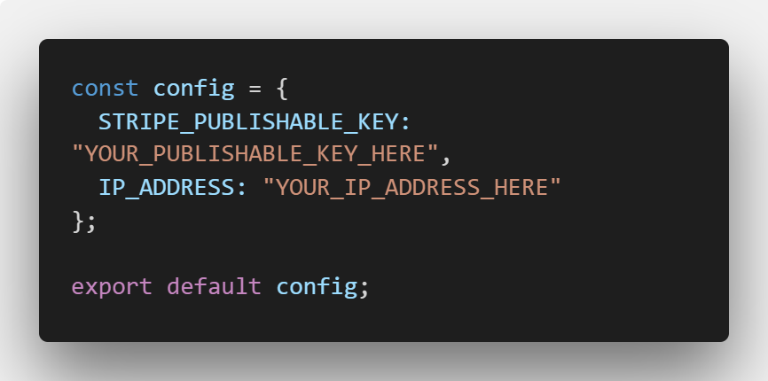

<h1 align="center">
  <br>
</h1>

# ReactNativeStripe
Integration of [Stripe](stripe.com) in a react-native app.

## Getting started

1. Make sure you have [NodeJS](https://nodejs.org/), [npm](https://www.npmjs.com/) and [docker](https://docker.com/) installed

2. Clone down the repository

3. Install the dependencies on the client-side 

   ```
   npm install
   ```

   in the *client* directory

4. Start all the microservices by running the following command in *server* directory
 
   ```
   docker-compose up
   ```

   With this command, `docker` will also install all the required dependencies in the API gateway and in each microservice,      which are all individually served in a *docker container*. 

5. Start the app

   ##### android
   ```
   react-native run-android
   ```

   ##### ios
   ```
   react-native run-ios
   ```
  
## Integrate your Stripe account to the project
1. You can create a [Stripe account](https://dashboard.stripe.com/register) in case you don't have any.
2. If you already have one, you need to provide your `Publishable key` and `Secret key` in the project.
   You can find these in the [Dashboard page](https://dashboard.stripe.com/account/apikeys) of your Stripe account.
3. After you find the `Secret` and `Publishable` keys, you need to do the following:
   In *server* directory, create an `.env` file and provide the following value: `STRIPE_SECRET_KEY=*YOU_SECRET_KEY_HERE*`.
4. In *config.js* file located in the *client* directory, replace the `STRIPE_PUBLISHABLE_KEY` value      of the JSON with your own publishable key value.
5. In the same *config.js* file, change the `IP_ADDRESS` value with your machine's IP address.

Your *config.js* file in the *client* directory should look like this:
<h1 align="center">
  <br>
</h1>

If you run into issues starting the app, please refer to the [React Native docs](https://facebook.github.io/react-native/docs/getting-started.html). It's most likely a problem with your environment.
